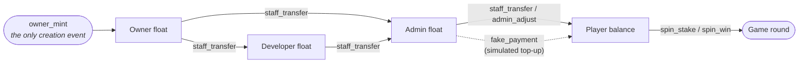
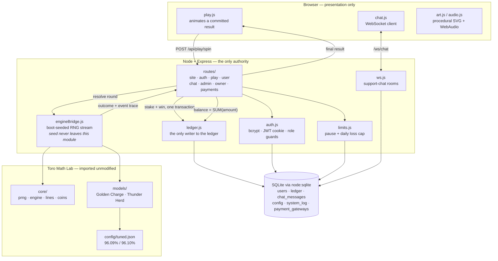

# Winners Gaming Club

**A gambling harm-reduction demonstrator.** It is a working, full-stack pokies (slot machine)
platform — real math engines, real server-authoritative outcomes, a real ledger — built so that the
mechanics which make these machines so effective at extracting money can be read, run, and taken
apart instead of merely described.

It is deliberately **not** a gambling product, and it is not a prototype of one.

---

## There is no real-money infrastructure here. That is the point.

This bears saying before anything else, plainly and without qualification:

- **No payment gateway.** No Stripe, no PayPal, no Braintree, no Apple/Google Pay SDK, no PSP
  client of any kind. Nothing in this codebase opens a socket to a payment network.
- **No card handling.** There is no card-number field anywhere in the application. No PAN, CVV,
  expiry, billing address or bank detail is collected, stored, transmitted, or validated.
- **No deposits and no withdrawals.** No code path converts a balance into money, or money into a
  balance, in either direction.
- **No real-money wagering.** Every balance is a **Club Credit**: an in-app demo token with no cash
  value, labelled as such on every screen that shows one.

The application *does* contain a page called "Add Club Credits" and a staff page called "Payment
Gateway". Both are simulations, and the README is telling you that before you find them in the
source: the gateway page toggles four method names on and off and stores an obviously-fake
placeholder credential (`FAKE-MERCHANT-0000-0000`, `fake-merchant@example.invalid`); the top-up page
moves demo credits from a staff member's own float to a player's, through the exact same internal
ledger transfer used everywhere else, tagged `fake_payment`. They exist because a demonstrator that
skipped the "just add more" button would be omitting one of the most consequential mechanics it set
out to show.

Nothing was stripped out to make this claim true. The real-money rails a licensed operator needs —
payment processing, KYC/AML, certified RNG, a gambling licence — were never built, because they are
a legal and commercial undertaking rather than a coding task, and because building them was never
the objective.

---

## Why it exists

Most public writing about gambling harm has to argue from the outside: it describes what a machine
does to a player without being able to show the machinery. This project shows the machinery.

The engines here are tuned to ~96% RTP — a publicly known return target for this class of game — and
validated over tens of millions of simulated spins. Once the math is that honest, the harm-reduction
argument stops needing rhetoric and becomes arithmetic you can read out of the validation reports in
[`reports/`](reports/):

- **~96 back per 100 wagered, forever.** Not per session — per spin, on average, without memory. The
  4 credits of edge are charged again on every re-wager of the 96 you got back. The house does not
  need luck; it needs turnover.
- **Two thirds of the return is locked outside the base game.** Ordinary line wins account for just
  29.5% of Golden Charge's return and 30.6% of Thunder Herd's; everything else is paid by features.
  For Thunder Herd, essentially all of that rides on one hold-&-respin event that fires about once in
  121 spins. The base game is *supposed* to feel starved — that is not bad luck, it is the design
  brief.
- **A "win" is usually a loss.** Hit rate looks reassuring at about one round in three, but around
  **89.5%** of Golden Charge rounds and **90.8%** of Thunder Herd rounds return *less than the amount
  staked* — including every round that lights up, plays a jingle, and hands back half a bet. The
  losses-disguised-as-wins effect is measurable in the round-win distribution tables, not merely
  asserted.
- **Dead streaks are engineered, not anomalous.** Longest observed runs with zero return: 38 spins
  (Golden Charge) and 41 (Thunder Herd), with a mean dead-run length of ~3.
- **Volatility is a design parameter, aimed at you.** Thunder Herd's volatility index (12.71) is
  deliberately higher than Golden Charge's (8.70): rarer, larger, more memorable outcomes around the
  same average return. Two machines with effectively identical RTP can feel completely different, and
  that difference is chosen by a designer.

The application layer wraps that math in the rest of the apparatus — a members' club, a support team
that tops you up when you hit zero, a "payment" page, tiered staff dashboards — because the
mathematics is only half of how these products work. The other half is the surrounding system, and
it is reproduced here with demo credits so it can be examined without anyone losing anything.

The harm-reduction posture is built into the running app, not bolted on:

- A [`/responsible-play`](app/views/responsible_play.ejs) page with warning signs and independent
  helpline listings, linked from the header and footer of every page.
- **Self-service limits that only tighten.** A player can set or extend a break, or set or lower a
  daily net-loss cap, instantly and without approval. Loosening or clearing one early requires a
  conversation with support. That asymmetry is deliberate friction, and it is enforced server-side
  before every spin (`app/server/limits.js`), not in the client.
- A persistent "CLUB CREDITS ONLY — NO CASH VALUE" banner for logged-out visitors, and a home page
  that explains the house edge in its own marketing copy rather than hiding it.

---

## What's in the repository

Two connected halves, published together because the second is built on the first.

| | |
|---|---|
| **Toro Math Lab** — `core/` `models/` `sim/` `tests/` `config/` `reports/` `site/` | The mathematics. Two original slot engines, tuned by exact combinatorics to 96.09% and 96.10% RTP, validated by a Monte Carlo harness, plus a static research site that runs the identical engine sources. Zero dependencies. |
| **Winners Gaming Club** — `app/` | The platform. Express + SQLite, four account roles across three dashboards, an append-only credit ledger, server-authoritative spins, live support chat, responsible-play controls. |

```
core/       prng.js (mulberry32) · engine.js (5x3 strips + line evaluator) · lines.js (30 lines) · coins.js
models/     modelA.js — "Golden Charge" (wild collector) · modelB.js — "Thunder Herd" (hold & respin)
sim/        exact.js (closed-form math) · tune.js (auto-tuner) · run.js (Monte Carlo harness) · stats.js
tests/      verify.js — 21 deterministic feature-math checks driven by scripted RNG
config/     tuned.json · validation_summary.json (both generated)
reports/    final_report.md · modelA_validation.md · modelB_validation.md
site/       static research site; build.js bundles the real engine sources into site/engine.js
app/        the Winners Gaming Club platform (server/ · views/ · public/)
```

---

## The mathematics

### Two original engines

Both games run on one shared core: a 5x3 window over 60-stop weighted reel strips (weighting is by
repetition, so every stop is equally likely and the strip layout controls the joint distributions),
30 fixed paylines evaluated left to right with wild substitution, and a shared coin-value system.
The reference bet is 30 credits (30 lines x 1 credit). Coin values are denominated in *credits*, so
RTP is identical at every denomination — a deliberate modelling choice, documented in the report.

**Golden Charge** (`models/modelA.js`) is a wild-collector game. Two or more Bulls anywhere in the
window fire a Charge Hit: *each* Bull collects the sum of every visible Gold Coin value (two Bulls
pays the full coin sum twice), then transforms into a silver coin revealing its own prize. Three or
more Ranch Gate scatters open 15/20/25 free games on hotter strips, with retriggers.

**Thunder Herd** (`models/modelB.js`) is a hold-&-respin game. Six or more Money Bulls lock the grid
into 15 independent positions with 3 respins that reset on every new landing. Collector Bulls arrive
holding the sum of everything already revealed; Diamond Bulls add extra positions played in a second
"Stampede phase". The GRAND (30,000cr = 1000x bet) is won by filling all 15 positions or covering all
five columns in the Stampede phase — never by landing a coin.

### The tuning method: exact math first, Monte Carlo second

The **only** tuned parameters are the coin-value distributions. Strips, paytables, and feature
probabilities are fixed design. That makes each model's return a linear function of its coin means,
which is solved in closed form rather than searched for:

- **Golden Charge is fully closed-form.** Line pays come from exhaustive enumeration over per-reel
  symbol marginals, pushed through the very same `lineWin5()` the simulator runs. Scatter/Bull/Coin
  window joints come from per-stop enumeration convolved across the five reels. Free games are a
  branching process (m = 0.1308 new spins per free spin, giving 17.57 expected free spins per
  trigger). RTP is then linear in the coin mean and the silver mean, and with the design ratio
  μ_silver = 0.5 · μ_coin there is exactly one solution: μ_coin = 104.764, μ_silver = 52.382.
- **Thunder Herd separates structure from values.** A feature's payout is a random linear
  combination of i.i.d. value draws whose coefficients — how many times each draw ultimately gets
  paid, including collector doubling — do not depend on the values themselves. Line pays and the
  trigger probability are exact; E[coeffSum] = 10.6326 (standard error 0.0013) and P(GRAND) =
  0.009244 were estimated from **16,000,000 simulated features**, after which μ_coin = 197.938 is
  solved in closed form.
- The tuner (`sim/tune.js`) then re-weights a *fixed* value list — it never invents new prize values
  — by bisecting between a bottom-heavy and a top-heavy weight profile until the distribution mean
  equals the required mean to double precision.

### Validation results

Taken from `config/validation_summary.json` and the reports in `reports/`; every figure regenerates
from the printed seeds.

| | Golden Charge (A) | Thunder Herd (B) |
|---|---|---|
| Target RTP | 96.09% | 96.10% |
| **True RTP of the tuned model** | **96.0900%** (exact, closed form) | **96.1000% ± 0.0412%** (95% CI) |
| Measured RTP | 95.9866% over 10M spins (seed 20260808) | 96.0959% over 60M spins (seed 999) |
| 95% CI of the measurement | [95.4475%, 96.5257%] — target inside | [95.7744%, 96.4175%] — target inside |
| Hit rate | 33.36% | 33.60% |
| Volatility index (SD of round multiple) | 8.70 | 12.71 |
| Return in base line pays | 29.51% | 30.61% |
| Return outside base line pays | 66.6% (scatters + collect + silver + free games) | 65.49% (hold & respin incl. GRAND) |
| Main feature frequency | free games 1 in 116.7; Charge Hit 1 in 35.7 | 1 in 121.2 |
| GRAND frequency | 141 hits in 10M (via silver reveal) | ~1 in 13,118 spins |
| Longest observed dead run | 38 spins | 41 spins |
| Max win observed | 5,123x bet | 3,192x bet |

Feature mechanics are separately covered by **21 deterministic checks** (`tests/verify.js`) that
force every branch with scripted RNG queues — double-collect identity, collector-collects-all,
reset-to-3, Stampede-phase extras, grid-fill GRAND, free-game grants, wild-run line rules — plus
randomized invariants over 100,000 features.

### One honest caveat, kept in the open

A ±0.05% return target **cannot be demonstrated** by a raw 10M-spin measurement when the per-spin SD
is 9–13x bet: such a measurement carries a standard error of roughly 0.27–0.39% of bet, an order of
magnitude wider than the tolerance. What this project delivers is that the *true* RTP of the tuned
models sits within ±0.05% of target (Golden Charge exactly; Thunder Herd to ±0.041% at 95%
confidence), with every Monte Carlo run statistically consistent with it.

The reports keep the inconvenient run on the record: the first Thunder Herd 10M seed measured 95.12%,
about 2.5 standard errors low, driven by an unlucky GRAND count (696 against ~762 expected). Three
further 10M seeds measured 96.23% / 95.67% / 97.08%, and the 60M run 96.0959% — scattered around the
solved value exactly as sampling theory predicts. Which is, incidentally, the same lesson the
demonstrator is trying to teach: over any span a human being actually plays, the number you *observe*
tells you very little about the number that is actually charging you.

---

## The platform

### Roles and dashboards

Four account roles, arranged as a strict hierarchy, across three dashboards. The role is a `CHECK`
constraint in the schema, and every route is guarded by `requireRole()`.

**Owner → Developer → Admin → User.** Only `role='user'` accounts can play; every other role manages
the platform and cannot spin at all.

| Role | Dashboard | What it can do |
|---|---|---|
| **Owner** | `/owner` | Feature toggles and bet limits, the full RTP / model-comparison table, an in-app viewer for the validation reports, the system log, ledger-integrity status, and unrestricted staff-account management (create, disable, change role, reassign, reset password). Engine math is **not** editable here — only presentational config. |
| **Developer** | `/admin` (developer view) | Manages the admins they created — and only those. Create, disable, reset password, fund from their own float. Never manages players directly. |
| **Admin** | `/admin` | User search/create/disable, per-user ledger view, manual credit adjustment (reason mandatory, written to the ledger with the acting admin's ID), responsible-play limits, live support chat — **scoped strictly to the players assigned to their own Staff ID** (e.g. `ADMIN01`). |
| **User** | `/play`, `/history`, `/account`, `/chat` | Play both games at any whole-credit bet inside the configured range, full personal transaction history, self-service responsible-play limits, support chat with screenshot attachments. |

Platform-wide analytics (registered users, credits in circulation, live measured RTP) are
**owner-only** — not even the admins generating that activity see the aggregate picture, only their
own scoped slice of it.

### The ledger is the balance

There is no `balance` column anywhere in this schema. A balance is always `SUM(ledger.amount)`,
re-derived on every request:

- Every credit movement is one **immutable** row. Nothing ever `UPDATE`s or `DELETE`s a ledger row; a
  correction is a new offsetting row.
- Each row also stores a `resulting_balance` snapshot written atomically with it — never as the
  source of truth, only as a cross-check. `verifyIntegrity()` replays every user's rows and asserts
  the running sum matches every snapshot, and the owner dashboard surfaces the result.
- A spin's stake and its win are written inside **one** SQLite transaction (`BEGIN IMMEDIATE`, so two
  concurrent spins for the same account serialize instead of racing), so a crash mid-round can never
  leave a stake deducted with no resolution recorded.
- Negative balances are unreachable by construction: `writeEntry()` throws `InsufficientBalanceError`
  before inserting anything that would take an account below zero.
- `app/server/test_ledger_integrity.js` is the executable proof — signup bonus, atomic spins,
  overdraft rejection with zero partial writes, mandatory adjustment reasons, 500 rapid spins with no
  desync, and a whole-database integrity sweep. It runs against an in-memory database and never
  touches real data. `npm run test:ledger`.

### The credit supply chain

Credits are created in exactly one place and can never be conjured anywhere else:



Every arrow is a balance-checked transfer against the sender's *own* float — an admin cannot hand out
credits they never received. Taking credits back out is the exact mirror: a transfer from the target
back to the acting staff member, never destruction. The "simulated payment" path is the same
mechanic, tagged distinctly in the ledger so it is always identifiable as what it is.

### Support, chat, and routing

Support chat is a plain WebSocket service (`app/server/ws.js`) generalized across the whole
hierarchy: a player talks to their admin, an admin talks to the developer who created them, a
developer talks to the owner. One `chat_messages` table serves every tier — `sender_role='user'`
always means "the thread-owner side" and `'admin'` the "manager/responder side", regardless of the
real roles involved. Managers can watch a managed account's room, and that watch is re-validated
server-side against the assignment, not trusted from the client.

Players route themselves to a support queue by quoting a Staff ID at signup or in their first support
message; staff can transfer a player between admins.

### Operator information stays with the operator

The public marketing site explains how the games work and what they pay — the paytables are rendered
live from the engine's own constants, not typed in by hand — but it never shows RTP, hit rate,
volatility, or the validation reports. Those live behind `/owner`. That split is itself part of the
demonstration: the number that decides the outcome is precisely the number a real player is least
likely to be shown.

---

## Server-authoritative spins, and why it matters

**The client never decides an outcome.** It cannot. A spin is a POST of two values — which model, and
how many credits — and everything else happens on the server:

1. `POST /api/play/spin` re-checks authentication, role, the model's enabled flag, the configured bet
   range, the player's responsible-play block state, and the balance *freshly derived from the
   ledger*.
2. `app/server/engineBridge.js` resolves the round against `core/` and `models/` — **imported
   unmodified**, the same files the Monte Carlo validation ran — using a single continuous RNG stream
   seeded once at boot from the OS CSPRNG, mirroring a real cabinet's free-running RNG.
3. The stake and any win are committed to the ledger in one transaction.
4. Only then does the server return the outcome, along with a full event trace for the animation.

The browser receives a result that is already final and already recorded, and replays it. The reel
data it uses to animate (`public/js/reeldata.js`) is generated from the real strips, but it is
presentation only: reel index cannot decide credits, it can only decide how fast to *show* a decision
the server already committed.

Why this matters beyond correctness: it is the difference between a game and an animation of a game.
If outcomes were computed client-side, a player could trivially rewrite them — and, more to the point
for a harm-reduction demonstrator, every claim the math makes about long-run return would be
unfalsifiable. Here the ledger is the audit trail: `/admin/analytics` computes *measured* RTP
straight out of real recorded play and puts it next to the solved target.

Bet scaling is handled the same disciplined way. Any whole-credit bet in the configured range is
supported by rescaling the tuned 30-credit reference figures, with **each individual credit figure
rounded at the moment it is emitted** and the round total taken as the sum of those already-rounded
figures — never a separate rounding of a float total. What the player sees always adds up to exactly
what was written to the ledger.

---

## Architecture



---

## Tech stack

- **Runtime** — Node.js 24. The app uses Node's built-in `node:sqlite` driver, so there are no native
  modules and no build step; on Node 22.x that driver exists only behind `--experimental-sqlite`, so
  Node 24 is the target. The Toro Math Lab CLI has *no dependencies at all* and runs on Node 18+.
- **Server** — Express 4, EJS templates, `cookie-parser`, `dotenv`.
- **Data** — SQLite (`node:sqlite`), WAL mode, foreign keys on.
- **Auth** — `bcryptjs` (cost 12) and `jsonwebtoken` in an httpOnly session cookie.
- **Realtime** — `ws` for support chat; `multer` for image attachments.
- **Email** — `nodemailer`, opt-in, used only for password-reset codes.
- **Front end** — no framework. No raster images and no audio files anywhere in the project: every
  symbol is procedural vector art with a single consistent lighting model (`public/js/art.js`), and
  every sound including the tiered win jingles is synthesized at runtime with WebAudio
  (`public/js/audio.js`). Two webfonts are the only binary assets.

---

## Setup

**Requirements:** Node.js 24+ and npm. Nothing else — no database server, no build toolchain, no
API keys.

```bash
git clone https://github.com/ayushkaf/winners-gaming-club.git
cd winners-gaming-club

# 1. Configure. Note the destination: the server loads .env from its working
#    directory, and npm scripts run inside app/.
cp .env.example app/.env
#    Then edit app/.env and set WGC_JWT_SECRET to a long random string.
#    Every variable is documented inline in .env.example.

# 2. Install and initialise
cd app
npm install
npm run build:reeldata    # regenerate client reel visuals from the real strips

# 3. Create the first owner account. seed.js does not read .env, so pass these
#    on the command line (or accept the printed defaults for a local throwaway).
WGC_OWNER_EMAIL=you@example.com WGC_OWNER_PASSWORD='a-strong-password' npm run seed

# 4. Verify the ledger rules hold (in-memory database, touches nothing)
npm run test:ledger

# 5. Run it
npm start                 # http://localhost:3000
```

Log in as the owner, mint some credits on `/wallet`, create a developer or admin, and sign up a
player account in another browser profile to see both sides of the platform at once.

### Running the math lab

From the repository root (no `npm install` needed — zero dependencies):

```bash
node sim/tune.js A                    # exact closed-form solve  -> config/tuned.json
node sim/tune.js B 16000000           # feature-structure hunt + closed-form solve
node tests/verify.js                  # 21 deterministic feature-math checks
node sim/run.js A 10000000 20260808   # Monte Carlo validation + report
node sim/run.js B 60000000 999
node site/build.js                    # rebundle site/engine.js after any model change
```

Then open `site/index.html` directly in a browser — no server required. The demo machine, the worked
examples, and the live simulation dashboard on that page all run the identical engine sources the
validation used.

> After changing any model, re-run `sim/tune.js`, then `app/`'s `npm run build:reeldata` so the
> client's animation strips still match the engine the server resolves against.

---

## Screenshots & demo

<!-- TODO(owner): capture these from a locally seeded instance with dummy accounts only.
     Never screenshot a real user's account, chat thread, or email address.
     Suggested: 1280x800 viewport, dark theme as shipped. Store under docs/screenshots/. -->

| | |
|---|---|
| **The floor** — `/play` mid-feature | _TODO: screenshot_ |
| **Transaction history** — the ledger a player can actually read | _TODO: screenshot_ |
| **Owner dashboard** — RTP/model comparison + ledger integrity | _TODO: screenshot_ |
| **Admin dashboard** — scoped player list and manual adjustment | _TODO: screenshot_ |
| **Responsible play** — self-service limits | _TODO: screenshot_ |
| **Research site** — `site/index.html`, live simulation dashboard | _TODO: screenshot_ |

<!-- TODO(owner): optional short screen recording (GIF or MP4) of a full Thunder Herd
     hold-&-respin feature — it demonstrates the near-miss / reset-to-3 mechanic better
     than any still image can. -->

_TODO(owner): add a link here if a public demo instance is ever hosted, together with a note that
its accounts are disposable and its data is periodically wiped._

---

## Security notes

This is a demonstrator, not a hardened production deployment — but the parts that matter for a
published codebase were treated seriously:

- **The RNG seed is never exposed to any client.** The engine sources are public, and `mulberry32` is
  fully deterministic, so the boot seed is the only remaining secret in the outcome path: anyone
  holding it could replay the stream and know every future round before requesting it. It is
  generated from the OS CSPRNG, never logged, and deliberately absent from `getModelSnapshot()` —
  the object that `GET /api/play/state` serialises to any signed-in user. It never leaves its module.
- **Chat attachments are not public files.** Support screenshots are stored outside the static
  directory entirely (`app/data/uploads/chat/`, gitignored) and served by an authenticated route
  mounted *ahead* of `express.static`, which releases a file only to the parties to the thread it was
  posted in — your own thread, or one belonging to an account actually assigned to you. A URL alone
  gets an anonymous visitor nothing. Uploads are validated by MIME type against a four-format
  allowlist, capped at 5 MB, and written under a random UUID filename (the client-supplied name is
  never trusted, so there is no traversal or overwrite surface), and the WebSocket only accepts an
  attachment path matching one this server itself minted.
- **Password-reset codes are never persisted in readable form.** Codes are stored as a SHA-256
  digest, single-use, and expire in 15 minutes. When SMTP is unconfigured, the message body goes to
  stdout only — never into `system_log`, which is persisted and rendered verbatim on the owner's log
  page. `/forgot-password` returns an identical response whether or not the email is registered, so
  it cannot be used as an account-existence oracle.
- **Sessions** are httpOnly JWT cookies, `sameSite=lax`, `secure` under `NODE_ENV=production`, with a
  12-hour TTL. Passwords are bcrypt at cost 12. Staff-issued temporary passwords are shown once to
  the acting staff member to hand over out of band — never emailed, never logged.
- **Authorization is re-checked at the boundary, not inferred from the UI.** Scoped admins are
  restricted to their own assigned players in every route; the WebSocket `watch` frame re-validates
  the assignment against the database rather than trusting a manager's socket; a developer may view
  broadly but may never edit another staff member's gateway config.
- **The markdown renderer** used for the validation reports (`app/server/markdown.js`) escapes all
  text before applying markup and implements only a narrow subset — no general parser, no injection
  surface.
- **Nothing sensitive is committed.** The SQLite database and every WAL/SHM sidecar, all user
  uploads, and every `.env` variant are gitignored. This repository ships no user data.

Known limitations, stated rather than papered over: there is no CSRF token on form posts, no rate
limiting on login or password reset, and no Content-Security-Policy header. `mulberry32` is a
statistical PRNG, not a certified casino RNG. Any of these would need addressing before this ran
anywhere untrusted, which is exactly why it doesn't.

---

## Scope and limitations

- This is an **original parameterisation** built to publicly known return targets and publicly
  described mechanic families. No manufacturer's PAR sheets, code, artwork, or text were used or
  reproduced, so no claim of numeric similarity to any specific commercial machine is made or
  possible. What *is* guaranteed is internal correctness: the implemented mechanics match the
  specification exactly, and the tuned returns hit their targets as stated.
- The engines are **simulation-grade, not production-gambling-grade**. Nothing here implements the
  compliance, metering, or recall machinery a regulated jurisdiction requires.
- Everything is **demo credits**, everywhere, permanently. See the top of this file.
- If you or someone you know is affected by gambling harm: Gambling Help Online (Australia)
  **1800 858 858**; National Gambling Helpline (UK) **0808 8020 133**; **1-800-GAMBLER** (US).
  Numbers change — confirm the current one for your country.

---

## License

MIT — see [LICENSE](LICENSE). Copyright (c) 2026 Aayush Kafle.
